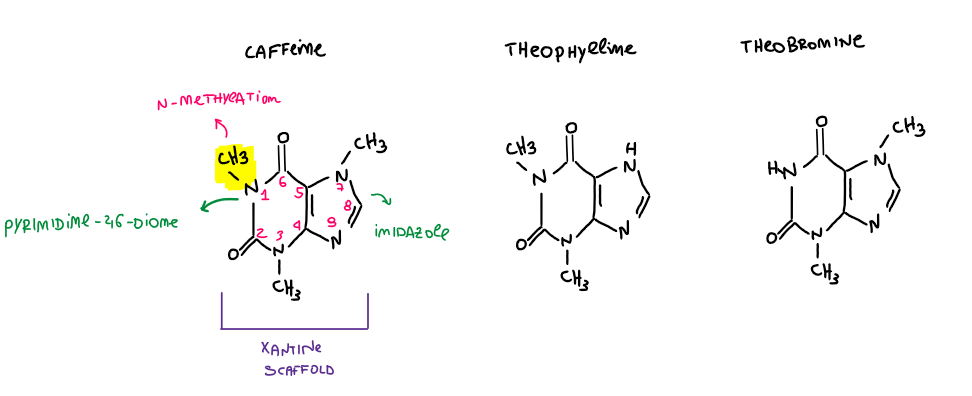
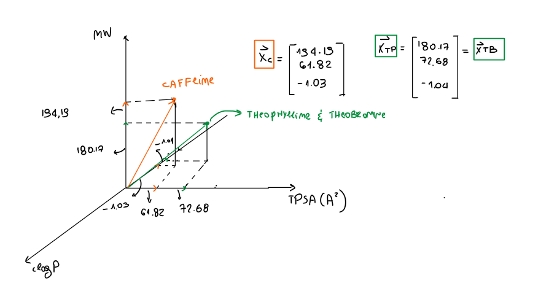

Getting Started: The Structure of a Chemoinformatics Dataset. 

Before diving into the details of molecular representation and how computers interpret chemical structures, let’s take a look at the image below.
Any proper chemoinformatics project begins with a dataset containing at least two colums.

The **first column** lists all $n$ entries (observations or molecules) measured in our experiment. Each molecule is associated with a starting representation—most commonly a **SMILES code** (we will return to the fact that a SMILES string is not always unique for a given molecule).

The **second column** contains the **endpoint** values, often referred to as the target variable or label in machine learning.     What is an Endpoint? An endpoint represents the biological or chemical property measured in an experiment. Common examples in chemoinformatics and bioinformatics include permeability (Papp A-to-B), activity (IC50), binding affinity ($K_d$, $K_i$), solubility, and lipophilicity ($\text{LogD}$). 

So, for every observation in the dataset, there is a corresponding endpoint value, and this can be **Categorical**: $y_i$ belongs to a discrete set of classes (e.g., active vs. inactive, high vs. low permeability) or **Continuous**: $y_i$ spans a continuous space of real numbers ($y_i \in \mathbb{R}$).

This one is our starting point :) 

**What does it mean to represent a molecule?**

Humans can interpret a molecule from the way it's drawn on paper — as a graph, where atoms are the nodes and bonds are the edges. This representation is especially useful for us when comparing two similar molecules and spotting their differences (we'll come back to this concept later).

For a computer, however, this process is far from trivial.

**Variables, Features, and Descriptors**

Before we can talk about how to represent a molecule numerically, we need to introduce the **concept of variables** (also called features or descriptors). These are typically grouped into three main classes:

**1D representations**

1D representations are simple linear encodings — the classic example is SMILES. Strictly speaking, SMILES is a representation rather than a descriptor: it's extremely useful for storing, exchanging, and reconstructing a molecule's structure, but on its own it doesn't provide the kind of quantitative, comparable information needed for most modeling tasks.

**2D descriptors**

2D descriptors are more interesting for quantitative work and especially useful for structural comparison and match-pair analysis (how to find match pairs: structural analogs with minor structural differences).

This class includes:

**numerical descriptors** — scalar properties computed from the molecular graph. The sets of numerical descriptors will define a space (the chemical space) where the molecule (the observation i-th) will be represented as a vector. 

**molecular fingerprints** — a large and important family of representations in their own right

We'll cover fingerprints in more detail in other posts. 

**3D descriptors**

3D descriptors depend on a molecule's conformation. We'll return to these further on, since computing them properly (conformer generation, energy minimization, etc.) adds a fair amount of complexity.

**Molecule as vectors**
Now, we need to introduce a way of thinking that is very useful in chemoinformatics. 
Computers love vectors; humans (me especially) a little bit less. 
In the context of 2D numerical descriptors, for example, we can represent a molecule as a vector in the space of the variables (chemical space). 

Let's look at the example above. 

Consider a generic molecule i described in a three-dimensional chemical property space, where the three dimensions correspond to molecular weight (MW), topological polar surface area (TPSA), and cLogP, for example. 

In this representation, the molecule is not described explicitly by its atomic structure and connectivity. Instead, it is represented as a point in a three-dimensional Euclidean feature (variable) space. 

Mathematically, this point can be represented by a three-dimensional feature vector: xi = (MW, cLogP, TPSA).

Each component of the vector corresponds to the molecule's coordinate along one of the axes (features, variables) of the chemical space. 

More precisely, each coordinate can be obtained by projecting the vector onto the corresponding axis.

Therefore, the magnitude of a given component reflects the value that the molecule has for that particular molecular property (variable)

In this way, a molecular structure can be transformed into a numerical representation in feature space, allowing molecules to be compared (via similarity) or used as inputs for an ML model. 

In the example above, molecule i has been represented as a 3D vector, because we used three variables to describe it. In practice, however, we usually use many more than three variables.

More generally, we can consider a generic molecule i as a point in a p-dimensional coordinate space, denoted by R^p.

When the number of dimensions is greater than three, we can no longer visualize the molecule as a vector in a conventional graphical representation. However, the underlying concept remains the same.

The molecule is represented as a p-dimensional feature vector.

**Why complicate things this way?**

Why convert a molecule, with its atoms and bonds, into a vector in a multidimensional space? The main reason is that this is a much more convenient formalism for a computer to work with.

But there is more to it. This representation allows the computer — and therefore us — to compute properties such as the similarity between two molecules using their vector representations.

As humans, with our chemical knowledge, we can look at a set of n molecules and intuitively understand which ones are structurally more similar. For a computer, however, this can be done by computing the distance (or similarity) between the corresponding vectors.

Let's look at an example below.

In the image above, three structural analogues are represented, i.e., molecules that share the same core structure and differ only through relatively minor structural modifications. In this particular example, the three molecules are methylxanthines: caffeine, theophylline, and theobromine.

All three compounds share the same xanthine scaffold: a fused bicyclic heterocycle composed of a pyrimidine-2,6-dione ring (the oxidized version of a pyrimidine) fused to an imidazole ring. The pyrimidine-2,6-dione ring contains two nitrogen atoms and two carbonyl groups, while the imidazole ring contains two nitrogen atoms.

The three molecules differ in their N-methylation pattern. Caffeine is 1,3,7-trimethylxanthine, meaning three nitrogen atoms bear methyl groups. Theophylline and theobromine are both dimethylxanthines, but they differ in which nitrogen atoms are methylated: theophylline is 1,3-dimethylxanthine, whereas theobromine is 3,7-dimethylxanthine.

The question is: how can we formalize this structural similarity using the vector formalism introduced above?

As a first step, we need to choose a set of molecular descriptors that we will use to represent our molecules. For simplicity, we will use the same three descriptors introduced above: molecular weight (MW), topological polar surface area (TPSA), and cLogP. Using three descriptors is convenient here because it allows us to visualize the molecules in a three-dimensional feature space.

We can then calculate the value of each descriptor for each molecule. Each molecule can therefore be represented as a point in the corresponding three-dimensional Euclidean feature space, or equivalently as a three-component feature vector (as seen before): xi = (MW, TPSA, cLogP).

In this representation, the structural information of the molecules has been transformed into a numerical representation in chemical feature space. Molecules that have similar values for these descriptors will be located close to one another in this space, whereas molecules with more different descriptor values will tend to be farther apart.

This gives us a first mathematical way of formalizing molecular similarity: instead of comparing molecules directly as graphs of atoms and bonds, we can compare the corresponding vectors in a multidimensional feature space.

